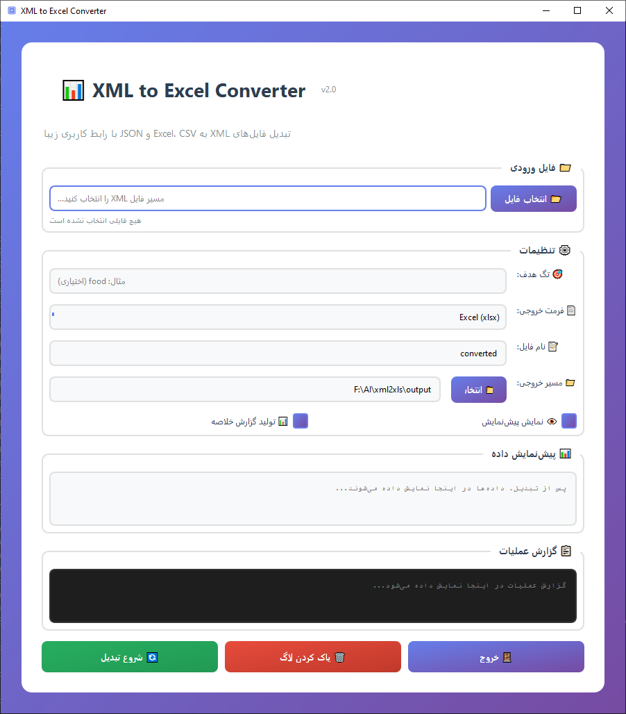

# 📊 XML to Excel Converter

[](https://python.org)
[](https://opensource.org/licenses/MIT)
[](https://pypi.org/project/PyQt5/)

> تبدیل فایل‌های XML به Excel، CSV و JSON با رابط کاربری زیبا و راست‌چین

## 📝 توضیحات پروژه

این برنامه یک نرم‌افزار دسکتاپ با رابط کاربری گرافیکی (GUI) است که به کاربران امکان می‌دهد فایل‌های XML را به فرمت‌های مختلف تبدیل کنند.

### ✨ ویژگی‌ها

- ✅ **رابط کاربری زیبا** با PyQt5 و استایل‌های حرفه‌ای
- ✅ **پشتیبانی از فارسی** با راست‌چین کامل
- ✅ **تبدیل به چندین فرمت**: Excel (xlsx)، CSV و JSON
- ✅ **انتخاب هر فایل XML** توسط کاربر
- ✅ **پیش‌نمایش داده‌ها** قبل و بعد از تبدیل
- ✅ **گزارش خلاصه** با آمار و اطلاعات مفید
- ✅ **مدیریت خطا** و نمایش پیام‌های کاربرپسند

### 🖼️ پیش‌نمایش



### 📦 نصب و راه‌اندازی

#### پیش‌نیازها
- Python 3.8 یا بالاتر
- pip (مدیریت بسته‌های Python)

#### مراحل نصب

```bash
# 1. کلون کردن پروژه
git clone https://github.com/YOUR_USERNAME/xml-to-excel-converter.git
cd xml-to-excel-converter

# 2. ایجاد محیط مجازی (توصیه شده)
python -m venv venv

# فعال‌سازی در ویندوز
venv\Scripts\activate

# فعال‌سازی در لینوکس/مک
source venv/bin/activate

# 3. نصب کتابخانه‌ها
pip install -r requirements.txt

# 4. اجرای برنامه
python run.py